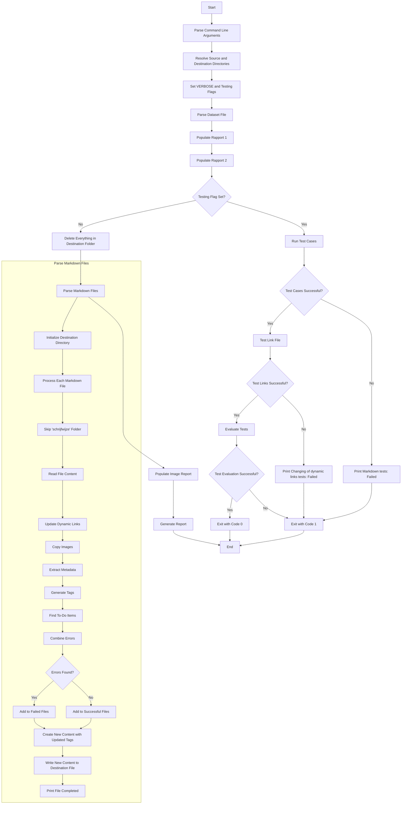

# Documentation compile_content.py

## Overview
The compile_content.py script is designed to update markdown files with taxonomie tags, generate reports, and optionally run tests. 
It processes markdown files from a source directory, updates them based on a dataset, and saves the updated files and reports to a destination directory.

## Command Line Arguments
The script accepts the following command line arguments:
- `--dataset`: The path to the dataset file (XLSX file). (Required)
- `--testing`: Determines if it should only check test cases. (Optional)

## Functions
### main()
The main entry point of the script. It performs the following steps:
1. Parses command line arguments.
2. Resolves the source and destination directories.
3. Sets the global VERBOSE and Testing flags based on the arguments.
4. Fills the reports with the dataset information by calling `parseDatasetFile`, `populateRapport1` and `populateRapport2`
5. If the `--testing` flag is set, it runs the test cases and evaluates the results.
6. If the `--testing` flag is not set, it deletes everything in the destination folder, parses the markdown files, populates the image report, and generates the final report.

### parseDatasetFile(dataset_file)
Parses the dataset file from an XLSX file to a list.

### parseMarkdownFiles(src_dir, dest_dir)
Updates markdown files in the source directory with taxonomie tags and generates reports.

### populateRapport1()
Fills the Rapport 1 data with the data from the dataset.

### populateRapport2()
Fills the Rapport 2 data with the data from the dataset.

### populate_image_report(src_dir, dest_dir)
Populates the image report with data from the images in the folders.

### generateReport() 
Generates the final report based on the taxonomie report, success, and failed reports.

### run_test_cases(TEST_DIR)
Runs the functions to test the pipeline.

### test_link_file(TEST_DIR)
Tests the file with incorrect links. This check makes sure incorrect links get noticed and "content/" gets filtered out.

### evaluate_tests(src_dir, dest_dir)
Evaluates the test results.

## Example Usage

```sh
python .github/compile_content.py --src "./content" --dest "./build" --dataset .github/datasets/dataset.xlsx --verbose
```

This command will process the markdown files in the content directory, update them based on the dataset in `./datasets/dataset.xlsx`, and save the updated files and reports to the build directory with verbose output.

## Execution Time
The script prints the total execution time at the end of the run.

```sh
Execution time: 2.34 seconds
```

