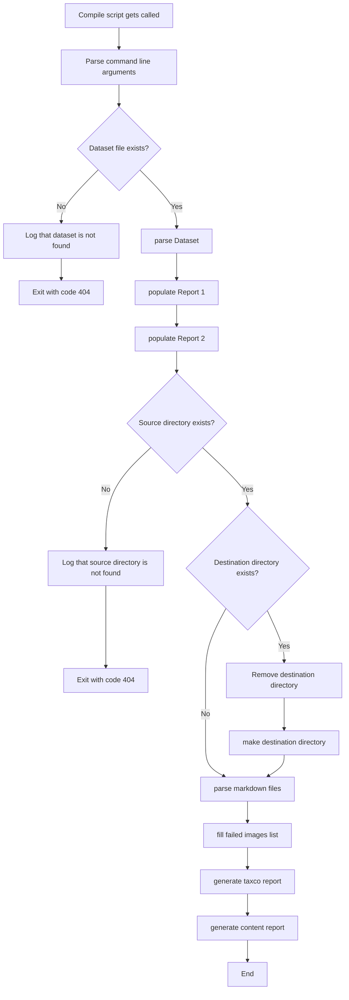
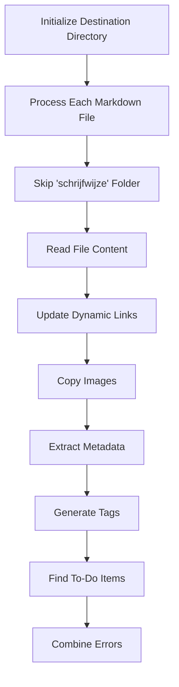

The compile_content.py script is designed to update markdown files with taxonomie tags, generate reports, and optionally run tests.
It processes markdown files from a source directory, updates them based on a dataset, and saves the updated files and reports to a destination directory.

## Command Line Arguments
The script accepts the following command line arguments:
- `--skip-link-check`: Skip link check in markdown files. (Optional)
	If this argument is not included, the default value will be false ( so all links will be checked)

## Functions
### main()
The main entry point of the script. It performs the following steps:
1. Parses command line arguments.
2. Checks if the DATASET global variabel exists
	1. If not, exits the script
3. Fills the reports with the dataset information by calling `parseDatasetFile`, `populateReport1` and `populateReport2`
4. Checks if the SRC_DIR is existing path
	1. If not, exits the script
5. Checks if DEST_DIR is existing path
	1. If it is, it removes and adds the folder again to remove the content of DEST_DIR
6. Parses markdown files
7. Fills the failed images list
8. Generate Taxco Report
9. Generate Content Report

### parseDatasetFile(dataset_file)
Parses the dataset file from an XLSX file to a list.

### populateReport1()
Fills the Report 1 data with the data from the dataset.

### populateReport2()
Fills the Report 2 data with the data from the dataset.

### parseMarkdownFiles(src_dir, dest_dir, skipDynamicLink)
Updates markdown files in the source directory with taxonomie tags and generates reports.

### fillFailedImages(src_dir, dest_dir)
Populates the failed image report with data from the images in the folders.

### generateTaxcoReport(report_path)
Generates the final Taxco report.

### generateContentReport(report_path)
Generates the final content report.

## Example Usage
```sh

python .github/script/compile_content.py --skip-link-check

```
This command will execute the compile_content script and thus fill in the reports if all processes succeed.

## Execution Time
The script prints the total execution time at the end of the run.
	`Execution time: 2.34 seconds`


## Entire workflow 
The entire workflow of the pipeline is seen below


*Diagram 1: Flowchart of entire compile process*


### Parse markdown files
The process of parsing the markdown files has quite a few steps, so they are visible in diagram 2.

*Diagram 2: Flowchart of the process of parsing the markdown files*
