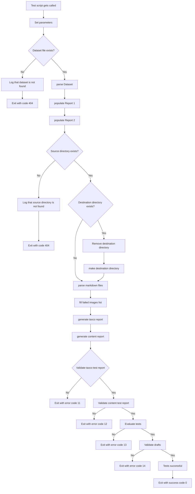

The run_tests.py script is designed to test the functionality of the compile_content.py script.
It processes test cases of markdown files to test all functionality. Furthermore, it checks the current content folder and see if it matches what it should contain.

## Functions
### test()
The main entry point of the script. It performs the following steps:
1. Set all parameters for the test folders and files
2. Checks if DEST_DIR is existing path
	1. If it is, it removes and adds the folder again to remove the content of DEST_DIR
3. Parses command line arguments.
4. Checks if the DATASET global variabel exists
	1. If not, exits the script
5. Checks if the SRC_DIR is existing path
	1. If not, exits the script
6. Checks if DEST_DIR is existing path
	1. If it is, it removes the content in the DEST_DIR
7. Fills the reports with the dataset information by calling `parseDatasetFile`, `populateReport1` and `populateReport2`
8. Parses markdown files
9. Fills the failed images list
10. Generate Taxco Report
11. Generate Content Report
12. Checks if the taxco report is the same as the expected taxco report
	1. If not, exits script with error code 11
13. Checks if the content report is the same as the expected content report
	1. If not, exits script with error code 12
14. Evaluates if the content directory contains the same amount of files as the temporary build folder that gets created
	1. If not, exits script with error code 13
15. Checks if the drafts are correctly applied 
	1. If not, exits script with error code 14
16. Exit script with success code 0 

### parseDatasetFile(dataset_file)
Parses the dataset file from an XLSX file to a list.

### populateReport1()
Fills the Report 1 data with the data from the dataset.

### populateReport2()
Fills the Report 2 data with the data from the dataset.

### parseMarkdownFiles(src_dir, dest_dir, skipDynamicLink)
Updates markdown files in the source directory with taxonomie tags and generates reports.

### fillFailedImages(src_dir, dest_dir)
Populates the failed image report with data from the images in the folders.

### generateTaxcoReport(report_path)
Generates the final Taxco report.

### generateContentReport(report_path)
Generates the final content report.

### validate_test_report(actual, expected)
Checks if an actual report is the same as the expected report

### evaluate_tests()
Evaluates if the content directory contains the same amount of files as the temporary build folder that gets created

### validate_draft()
Checks if the drafts are correctly applied


## Example Usage
```sh
python .github/script/tests/run_tests.py 
```
This command will execute the run_tests script and thus fill in the reports if all processes succeed.

## Execution Time
The script prints the total execution time at the end of the run.
	`Execution time: 2.34 seconds`


## Entire workflow 
The entire workflow of the pipeline is seen below


*Diagram 1: Flowchart of entire compile and test process*


### Parse markdown files
The process of parsing the markdown files is the same as in the compile_content.py documentation of diagram 2.

